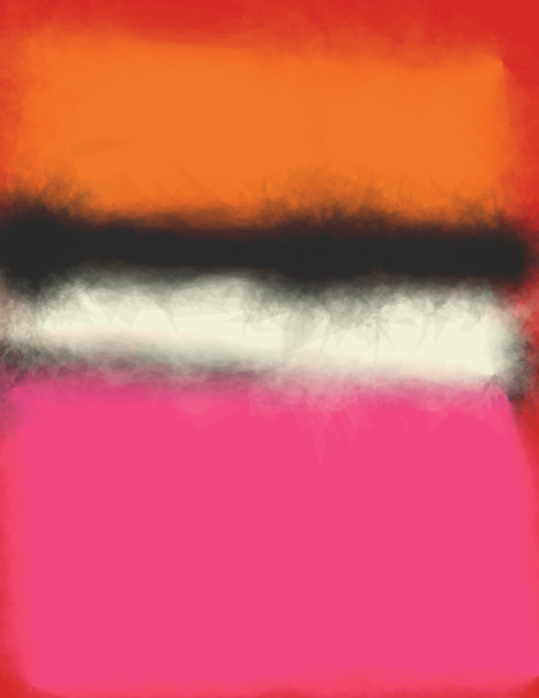

# RothkoPainter

Procedurally generated Mark Rothko paintings with Processing. 
Inspired by <a href="http://www.tylerlhobbs.com/writings/watercolor">this article</a> and a very old After Dark screen saver on Mac. It tweets the resulting images if the twitter_conf.json is correctly configured.

   
  <caption>White Center (Yellow, Pink and Lavender on Rose)</caption>

